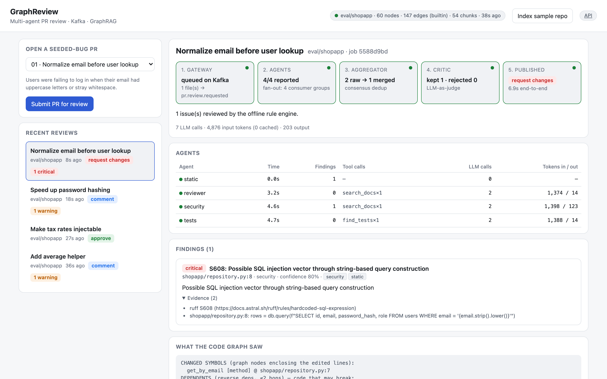
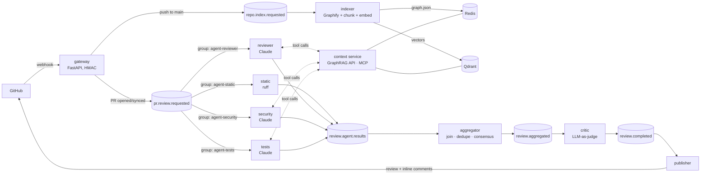

# GraphReview

**Event-driven, multi-agent pull-request review on Kafka and Kubernetes, grounded by GraphRAG.**

Specialist Claude agents (correctness, security, test coverage) review each PR in parallel. Instead of pasting whole
files into a prompt, every agent investigates through tools backed by a **code knowledge graph**
([Graphify](https://github.com/Graphify-Labs/graphify), tree-sitter, 25+ languages) and a **hybrid vector index**
(Qdrant, dense + BM25 fused with RRF). Static analysis runs alongside. An aggregator merges duplicate findings
across agents, an LLM-as-judge critic filters false positives, and the result is posted as a single GitHub review
with inline comments.

```
make install && make demo        # whole pipeline in-process: no Docker, no API key
make up && open http://localhost:8080   # full stack + live pipeline dashboard
```



**Demo runbook:** [docs/DEMO.md](docs/DEMO.md) covers terminal, dashboard, live GitHub PRs, and Kubernetes,
plus talking points.

---

## Architecture



| Kafka topic | Key | Producer → consumer group(s) |
|---|---|---|
| `pr.review.requested` | job_id | gateway → `agent-static`, `agent-reviewer`, `agent-security`, `agent-tests` (fan-out) |
| `review.agent.results` | job_id | agents → `aggregator` (all results for a job land on one partition) |
| `review.aggregated` | job_id | aggregator → `critic` |
| `review.completed` | job_id | critic → `publisher` |
| `repo.index.requested` / `repo.indexed` | repo | gateway → `indexer` |
| `review.dlq` | original | any worker, after 3 failed attempts |

### Review lifecycle

1. **Gateway** verifies the `X-Hub-Signature-256` HMAC, fetches PR files and patches from the GitHub API, dedupes
   redeliveries per head SHA (`SETNX`), stores the job in Redis and publishes it.
2. **Agents.** Each role has its own consumer group, so every role sees every job while replicas within a role
   split partitions. LLM agents run a bounded tool-use loop:
   * the first prompt carries the diff with new-side line numbers plus a **graph impact report** (symbols enclosing
     the edited lines → reverse-dependency closure → tests that reach them)
   * tools: `get_callers`, `find_tests`, `search_code`, `search_docs`, `read_snippet`. Parallel tool calls run
     concurrently; changed files are read at the PR head, everything else from the indexed base
   * the last turn disables tools, and the final answer is **schema-constrained JSON** (structured outputs)
3. **Aggregator** joins results per job in Redis (it survives restarts and runs as several replicas). It clusters
   near-duplicates by file, ±3 lines, and category or text similarity. When independent agents agree, the merged
   finding's confidence goes up. A deadline sweeper flushes partial results if an agent never reports.
4. **Critic** judges each LLM finding against the diff and packed graph context. It drops false positives,
   recalibrates severity and confidence, and writes the summary and verdict. Deterministic static-analysis
   findings skip the judge.
5. **Publisher** posts one GitHub review. Findings on diff lines become inline comments. Findings outside the diff,
   such as a broken caller the graph found in an untouched file, go in the review body.

---

## GraphRAG: why both a graph and vectors

| Question a reviewer asks | Answered by |
|---|---|
| Which functions did this hunk touch? | graph: line → innermost enclosing symbol |
| Who breaks if this signature changes? | graph: reverse BFS over `calls` / `imports` / `inherits` |
| Is this behaviour tested? | graph: tests reachable from the changed symbols |
| How does the rest of the codebase handle X? | vectors: hybrid dense (BGE-small) + sparse (BM25) search, RRF fusion |
| Does this violate a team convention? | vectors over repo docs (CONTRIBUTING, ADRs) |

Vector search can't answer "who calls this" reliably, and a graph can't answer "find similar code", so each tool
is backed by the structure that answers it. The index is built once per push to the default branch (incremental:
only changed paths are re-embedded). Chunks are AST-aligned and tile each file completely, so `read_snippet`
can rebuild any line range from the index without cloning the repo at review time.

**Graph builder.** The indexer runs `graphify extract --code-only` (tree-sitter, no LLM cost) and falls back to a
built-in, import-aware Python AST builder that emits the same schema. Tests and the offline demo use the fallback.

**MCP.** The same retrieval tools are exposed over MCP, so you can query the index from Claude Code or Cursor:

```bash
claude mcp add graphreview -- graphreview mcp --repo acme/shop --context-url http://localhost:8001
```

---

## Reliability

* **At-least-once delivery.** Offsets are committed only after the handler (and its publish) succeeds. The
  producer is idempotent with `acks=all`.
* **Idempotent consumers.** Aggregator state is keyed by `(job_id, agent)`, flush is guarded by `SETNX`, the
  publisher posts at most once per job, and the gateway dedupes webhook redeliveries.
* **Retries and dead-lettering.** Each message gets 3 attempts with exponential backoff, then goes to
  `review.dlq` with origin and error headers.
* **Agents never block the pipeline.** A crashed or refused agent still publishes a result carrying an error, and
  the aggregator records `error` or `timeout` per agent instead of waiting forever.
* **Long LLM handlers.** `max.poll.interval.ms=600000` and `max_poll_records=1`. Pods get a 300 s termination
  grace period so in-flight reviews finish before shutdown.
* **Prompt-injection hygiene.** Diff, code and docs are framed as untrusted data in every system prompt.
  `read_snippet` blocks path traversal, and repo names are validated before cloning.

## Claude usage

* Model `claude-opus-5-5` by default (`AGENT_MODEL` / `CRITIC_MODEL`). Effort is set per role: high for
  reviewer and security, medium for tests and critic.
* **Structured outputs** (`output_config.format`) and `strict` tool schemas mean no regex-parsing of model output.
* **Prompt caching** (top-level `cache_control`). Each turn of the agent loop re-reads the system prompt, tool
  schemas and earlier turns from cache. The Grafana dashboard tracks the cache-hit share per agent.
* **Server-side refusal fallback** (beta `server-side-fallback-2026-07-01`, `fallbacks: "default"`). A declined
  request is re-run on a fallback model instead of failing the review.
* Assistant turns are replayed verbatim (thinking blocks included), so the tool loop is append-only.

---

## Quick start

### 1. In-process demo (no Docker, no keys)

```bash
make install                 # creates .venv; then `source .venv/bin/activate` for the graphreview CLI
make demo                    # CASE=01..11 picks a seeded bug from eval/cases
make demo-claude CASE=05     # real Claude + embeddings; needs ANTHROPIC_API_KEY
graphreview review-local --repo-path . --base main   # review your own working tree
```

`make demo` runs every service on an in-memory bus with an embedded Qdrant. It uses a deterministic rule-based
stand-in for Claude and hash embeddings, so it runs in CI.

### 2. Docker Compose (full stack)

```bash
make up                      # copies .env.example → .env (keyless: LLM_BACKEND=fake) on first run
curl -XPOST localhost:8080/api/repos/index -d '{"repo":"owner/name"}' -H 'content-type: application/json'
curl -XPOST localhost:8080/api/reviews -d '{"repo":"owner/name","pr_number":123}' -H 'content-type: application/json'
curl localhost:8080/api/reviews/<job_id>
```

The **dashboard** at <http://localhost:8080> is served by the gateway. It shows:

* recent reviews
* a live pipeline stepper per job (gateway → agent fan-out → aggregator → critic → published)
* per-agent latency, tool calls and tokens
* the code-graph impact report the agents received
* findings with agent attribution and evidence, plus the findings the critic rejected

With `DEMO_MODE=true` (the compose default), buttons index the bundled sample repo and submit seeded-bug PRs
through Kafka. `make stack-demo CASE=05` does the same from the terminal.

Grafana at <http://localhost:3000> (dashboard *GraphReview*), Prometheus at <http://localhost:9090>.
`docker compose --profile tools up kafka-ui` adds a Kafka UI on :8090.

### 3. Kubernetes (kind)

```bash
make k8s-up    # kind + Strimzi (Kafka, KRaft) + KEDA + dev overlay; gateway on localhost:8080
```

* `deploy/k8s/base` contains:
  * a Strimzi `Kafka` cluster and `KafkaTopic` resources (v1 API)
  * Redis and Qdrant StatefulSets
  * a Deployment per service, each with a hardened pod spec (non-root, read-only root FS, all capabilities
    dropped, seccomp)
  * PodDisruptionBudgets, default-deny NetworkPolicies, and a CPU-based HPA for the HTTP tier
  * **KEDA `ScaledObject`s that scale each agent role on its consumer-group lag**. Max replicas equals the
    partition count.
* **Measured on kind** (single node, 6 vCPU / 10 GB): a burst of 40 PRs pushed consumer lag to 12 per replica.
  KEDA scaled every agent tier from 1 to 6 replicas within about 20 s, and the backlog drained in about 50 s.
  This run used the offline LLM with 2 s of simulated latency. Repeat it with the burst loop in
  [docs/DEMO.md](docs/DEMO.md#d-kubernetes).
* `overlays/dev` targets kind and runs keyless by default (`config.env`). It uses single replicas,
  laptop-sized requests, a NodePort, and a `secretGenerator`.
* `overlays/prod` runs a 3-broker Kafka with RF=3 and min ISR 2, pulls registry images, and adds a TLS Ingress.

### 4. Connect GitHub

**Scripted demo:** `make github-demo` asks before doing anything, then:

* creates `<you>/shopapp-graphreview-demo` from the sample app
* forwards its webhooks to localhost with `gh webhook forward` (no public tunnel needed)
* indexes it and opens seeded-bug PRs, which get reviewed with inline comments

See [docs/DEMO.md](docs/DEMO.md#c-live-github-prs) for the one-time setup.

**Your own repos:**

Webhook URL `https://<host>/webhook`, content type `application/json`, secret = `GITHUB_WEBHOOK_SECRET`,
events **Pull requests** and **Pushes**. The token needs pull-request write and contents read permissions.

---

## Evaluation

`eval/` holds a seeded-bug benchmark. It uses a small storefront app (`eval/fixtures/shopapp`) with
team conventions in `CONTRIBUTING.md`, plus 11 cases. Each case is a find/replace edit with a **neutral PR title**:

| | Case | Needs |
|---|---|---|
| 01 | email lookup switched to an f-string query | security |
| 02 | discount computed with floats | convention lookup (money is integer cents) |
| 03 | authorization check removed from a handler | security, convention lookup |
| 04 | payment call loses its timeout | convention lookup |
| 05 | `compute_tax` gains a required parameter; callers not updated | **graph** (callers outside the hunk) |
| 06 | refund failures swallowed | error handling |
| 07 | PBKDF2 replaced with MD5 | security |
| 08 | pagination offset off by one page | logic |
| 09 | `average()` divides by `len()` of a possibly empty list | edge case |
| 10 | stock check inverted | logic |
| 11 | docstring-only change | **negative control** (should produce no findings) |

```bash
make eval            # Claude: graph_rag vs full_files vs diff_only → eval/results/eval-<ts>.{json,md}
make eval-offline    # harness smoke test with the rule-based stand-in (what CI runs)
```

The benchmark scores each context mode on:

* **Recall.** Seeded bugs hit by a finding in the same file within ±3 lines.
* **Precision.** Defect findings that match a seeded bug. Test-gap findings are reported separately.
* **False positives** on the clean PR.
* **Tokens, estimated $ per review, and latency.**

The three modes are an ablation:

* `diff_only`: the diff alone
* `full_files`: the diff plus every changed file in full
* `graph_rag`: the impact report plus tools

Results are written to `eval/results/`. Run it with your key to get numbers for your model and budget.

---

## Observability

Prometheus metrics, all prefixed `graphreview_`:

* bus throughput and outcomes (`ok` / `retry` / `dlq`) per service
* handler latency
* LLM tokens by agent and kind (input / output / cache read / cache write)
* LLM requests by stop reason
* tool calls by tool
* retrieval latency by operation
* findings by stage and severity
* critic rejections
* webhook-to-review latency
* indexing time

Logs are JSON, one object per line, and carry `job_id` for correlation across services. A provisioned Grafana
dashboard covers all of the above.

## Configuration

Settings come from environment variables (see `src/graphreview/common/config.py`). The common ones:

| Variable | Default | |
|---|---|---|
| `BUS_BACKEND` / `KAFKA_BOOTSTRAP` | `kafka` / `localhost:9092` | `memory` for in-process |
| `STATE_BACKEND` / `REDIS_URL` | `redis` / `redis://localhost:6379/0` | |
| `QDRANT_URL` | unset → embedded | |
| `LLM_BACKEND` | `anthropic` | `fake` = deterministic rule engine |
| `AGENT_MODEL` / `CRITIC_MODEL` | `claude-opus-5-5` | |
| `EMBEDDING_BACKEND` | `fastembed` | `hash` for tests |
| `EXPECTED_AGENTS` | `["static","reviewer","security","tests"]` | JSON list |
| `MAX_AGENT_TURNS` | `8` | tool-loop bound |
| `CRITIC_MIN_CONFIDENCE` | `0.6` | |
| `AGGREGATION_TIMEOUT_S` | `300` | partial flush deadline |
| `GITHUB_TOKEN`, `GITHUB_WEBHOOK_SECRET` | | unsigned webhooks are refused unless `ALLOW_UNSIGNED_WEBHOOKS=true` |

## Layout

```
src/graphreview/
  common/      models, Kafka/memory bus, worker loop (retry/DLQ), Redis state, GitHub client, LLM layer, metrics
  retrieval/   graph builder + CodeGraph queries, AST chunker, embedders, Qdrant hybrid store, GraphRAG retriever
  context/     retrieval HTTP API, HTTP client, MCP server
  agents/      tool box, agent specs/prompts, agentic loop, static analysis, worker
  aggregator/  join + merge + deadlines        critic/     LLM-as-judge
  publisher/   GitHub review rendering         gateway/    webhooks + REST
  indexer/     clone, Graphify, chunk, embed   eval/       benchmark harness
  pipeline.py  all of the above in one process (demo, eval, e2e tests)
deploy/        k8s (kustomize base + overlays), kind, Prometheus, Grafana
eval/          fixture repo + seeded-bug cases
tests/         unit + in-process end-to-end tests (no network)
```

## Design notes and trade-offs

* **One consumer group per agent role** gives fan-out without a router and lets each role scale on its own lag. A
  slow security agent doesn't hold back static analysis.
* **The graph is built from the default branch.** Symbols a PR adds aren't in the graph yet. The impact report
  falls back to file-level seeds for those, and the agents read the PR head directly.
* **Single-message processing per consumer** (`max_poll_records=1`) keeps commit semantics simple. Throughput
  comes from partitions × replicas, not in-process concurrency.
* **Graph blobs live in Redis**, gzip-compressed and versioned, so context-service replicas stay stateless and
  share one cache-invalidation signal. For very large monorepos, move them to object storage.

## Roadmap

* Learn from reviewer feedback: index resolved and dismissed comments as a "review memory" collection for the critic
* GitHub App auth and Check Runs instead of a personal token
* OpenTelemetry tracing across Kafka hops
* Per-repo agent configuration (`.graphreview.yml`)
